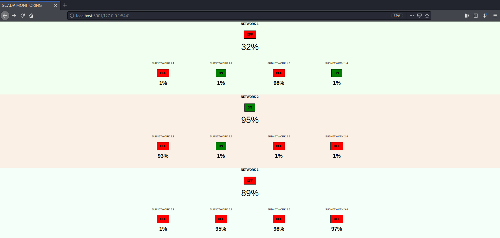

<h3 align="center">BASIC MONITORING INTERFACE FOR MODBUS</h3>
<h5 align="center">Web-based interface for Modbus Master (TCP client) to monitor Modbus Slaves (TCP servers)</h3>

## Table of Contents

* [About the Project](#about-the-project)
    * [Prerequisites](#prerequisites)
    * [Installation](#installation)
* [Launch](#launch)

## About the project
Simple web interface based on Python 2.7 and Flask that monitors a Modbus Slave through TCP-IP protocol.


### Prerequisites
* Python 2.7
* pip

### Installation
1. Clone the repo
```sh
git clone https://github.com/javier-pg/Basic-Modbus-Monitor.git
```
2. Change to Basic-Modbus-Monitor directory
3. Install required packages (using a virtual environment such as ```conda``` is highly recommended)
```sh
pip install -r requirements.txt
```

### Launch

1. Run the web server (_by default,  localhost at port 5001_)
```sh
python hmi.py
```

2. Visit _localhost:5001/{slave_address}:{slave_port}_ on your favourite web browser, where _slave_address_ and _slave_port_ are respectively the IP address and port of the modbus slave to be monitored.


3. The app reads the first 15 coils, which are interpreted as network/subnetwork statuses (ON/OFF), and the respective powers in percentage (%). Note that this app only refreshes (every 5 seconds) percentages and colors according to slave readed values, but not logic is implemented regarding certain correlations such as OFF = 0% (therefore, it must be coherent in the server side).




